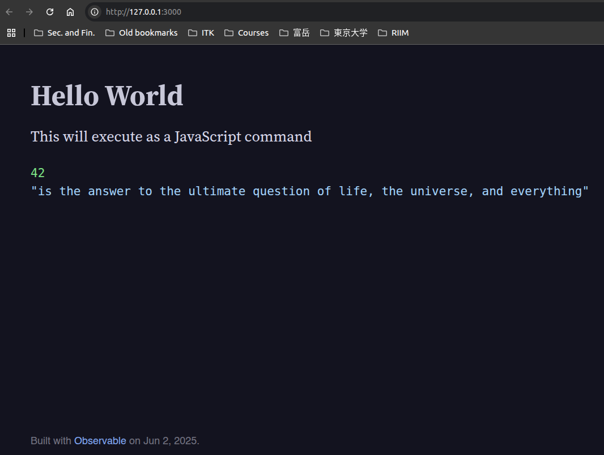

# Installation 

## Observable Framework installation

This installation for creating a simple app in Observable Framework is based
on https://observablehq.com/framework/getting-started.

1. Make sure that you have installed the latest NVM (Node Version Manager)
   - Windows: visit [this page](https://github.com/coreybutler/nvm-windows/releases), 
     and select `nvm-setup.exe`

   - Linux/Mac: See the tutorial of Structured Programming in week-01
     [here](https://github.com/LugoBlogger/SI-201-404-structured-programming/blob/master/hands-on/01-introduction.md#instalasi-nodejs)

2. Download this `week-14` directory, by copy 
   this link: https://github.com/LugoBlogger/SI-201-411-business-intelligence/tree/master/in-class/week-14   
   to this page, https://download-directory.github.io/.
   It will automatically download only the directory `week-14`.

3. Set your current working directory to the directory
   `/week-14/observablehq-framework-examples-hotel-bookings-start/`
   using `cd` command in VSCode terminal.

4. After that, install Node.js version 22.14.0, by entering this command 
   ```
   nvm install 22.14.0
   ```
   in the VSCode terminal

   (optional) if you have already installed it before, you can use the command
   ```
   nvm use 22.14.0
   ```

5. Install all required modules in `package.json` with 
   ```
   npm install
   ```
   [Note]: make sure that you are in the `/observablehq-framework-examples-hotel-bookings-start`
   directory. 

6. Run the localhost of Observable Framework with 
   ```
   npm run dev
   ```

   If your follow the installation procedure above correcty, you will get
   the following output in your browser    
   

7. Experiment how to create the dashboard, by editing `/src/index.md`.  
   The final output of dashboard is in `observablehq-framework-examples-hotel-bookings-end`.   
   You can start by copying directories `components` and `data` from that
   directory to `src`.

   Copy also the content of `index.md` from that final output to `/src/index.md`