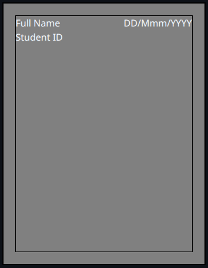

# Rules for portfolio assessment

To write your portfolio assessment, you need to follow strictly to all these rules.

1. Prepare a file in `draw.io` with the size of A4 paper. 
   Draw a margin with the size 1 cm around all the edges using a box.

   <!-- 

   

    

      

        Full Name  
        DD/Mmm/YYYY
      
 
      Student ID
    

   

   
 -->

   

   Write your name and the student ID number as shown in the above figure.   
   You may include the date to the top right of your paper.
   Make sure to draw also the margin. Please write the page number if 
   you do not separate each page in `draw.io`.

3. In each week, you have to write at least two pages of A4 in a `draw.io` file.
   Your portfolio assessment must contain the following parts
   - your notes during a class, and
   - progress on implementing case studies

   Check the case studies description in `case-studies` directory.

   At the end of the semester, you will accumulate at least 28 pages.
   Anyone who cannot meet this requirement are not be able to join
   the midterm and final exam.

3. You can improve your portfolio assessment content by adding some  
   illustration. You may use Nano Banana Pro for making illustration.

4. You have to submit to the teaching assistant for the evaluation of 
   your portfolio assessment. The teaching assistant will evaluate your
   writing if it does not make sense or not, including the steps
   of your analysis of the case studies.

5. Any submission that does not follow the above rules are rejected 
   and resulting zero grade.
  
6. You have to write with your own words and you have to understand all of them.