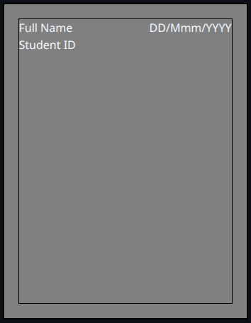

# Rules for portfolio assessment

To write your portfolio assessment, you need to follow strictly to all these 
rules. 

1. Prepare a file in `draw.io` with the size of A4 paper.
   Draw a margin with a distance around 4 boxes to all the edges of
   A4 paper layout.

   

   Write your name and the student ID number as shown in the above figure.   
   You must include the date to the top right of your paper.
   Make sure to draw also the margin. Please write the page number 
   at the bottom right of all the pages.

   You can use the given template [here](./template-portfolio-assessment.drawio).

   Rename your `.drawio` file with the following format:   
   `[student-id]-[full-name]`,    
   Ex: `10221000-Henokh-Lugo-Hariyanto.drawio`
   

3. In each week, you have to write at least four pages of A4 in your 
  `draw.io` file.  Your portfolio assessment must contain the following parts
   - your notes during a class, and
   - progress on implementing case studies
   - (optional) any improvement to your notes such as exploration to a 
     program in case studies and any detailed of definitions of 
     complicated terms using your own words.

   Check the case studies description in `case-studies` directory.

   At the end of the semester, you will accumulate at least 56 pages.
   Anyone who cannot meet this requirement are not be able to join
   the midterm and final exam.

3. You can improve your portfolio assessment content by adding some  
   illustration. You may use Nano Banana Pro for making illustration.

4. You have to submit to the teaching assistant for the evaluation of 
   your portfolio assessment. The teaching assistant will evaluate your
   writing if it does not make sense or not, including the steps
   of your analysis of the case studies.

5. Any submission that does not follow the above rules are rejected 
   and resulting zero grade.
  
6. You have to write with your own words and you have to understand all of them.